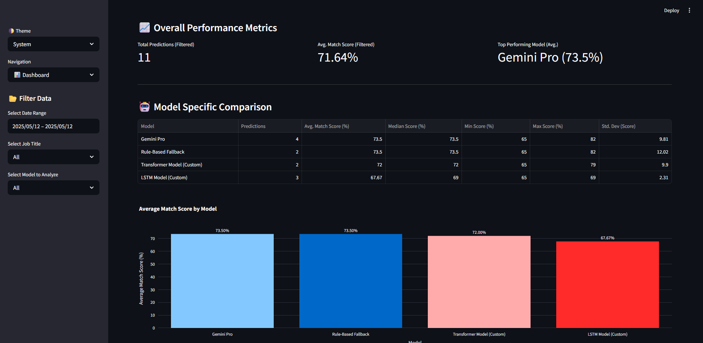

# 🧠 AI-Powered Resume Screening System

An advanced, intelligent, and fully interactive job application screening system that leverages multiple AI models **(Custom LSTM, Fine-tuned Transformer, and Gemini Pro)**, **NLP techniques**, a **Supabase backend** for data persistence, and dynamic visualizations to assist HR teams and job seekers with smart matching and actionable insights.

> This system aims to streamline the recruitment process, reduce manual screening time, and minimize potential bias by providing objective, data-driven insights.' This helps frame the value proposition immediately.

---

## ✨ Key Features

### 👔 For HR Professionals

- 📋 Add, edit, and manage job listings **stored in a Supabase database**.
- 📊 Comprehensive analytics dashboard with interactive visualizations, including model performance comparisons, **drawing data from Supabase**.
- 📈 Real-time insights into job market trends and performance.
- 🌍 Country-based and geospatial visualizations.
- 📁 Easily export prediction results (from applicant interactions logged in Supabase).

### 🙋‍♂️ For Job Applicants

- 🧠 Intelligent resume matching with job descriptions.
- 📎 Upload resumes to get personalized job matches.
- 🔍 Visual feedback on missing or suggested skills.
- 🤖 Choose between multiple analysis models:
  - ✅ **Custom Rule-Based Model** (Fallback for quick analysis)
  - 🧠 **Custom LSTM Model** (Deep Learning model for overall match score)
  - 🤗 **Custom Transformer Model** (Fine-tuned DistilBERT for overall match score)
  - 🔮 **Gemini Pro (LLM via API)** (For in-depth analysis and suggestions)
- 📊 See how your resume aligns with job expectations, with scores from different AI approaches. **Your analysis history can be logged for dashboard insights.**

### 📊 Data Visualization & Analytics Dashboard

- 🎯 Job title, employment mode, and location distributions **from Supabase job data**.
- ☁️ Skills WordCloud for demand overview.
- 💰 Salary vs. Experience/Employment scatter plots.
- 🌐 Country-based and geospatial plots.
- ⚖️ **Model Performance Comparison**: Analyze average scores, score distributions, and trends for each AI model used, based on **prediction history stored in Supabase**.
- 🚨 Top missing skills analysis.

---

## ⚙️ Tech Stack

- **Frontend**: Streamlit
- **Backend**: Python
- **Database**: **Supabase (PostgreSQL)** for job listings and prediction history.
- **AI Models**:
  - 🧬 **Custom LSTM Model** (Keras/TensorFlow, potentially with GloVe embeddings)
  - 🤗  **Custom Transformer Model** (Fine-tuned DistilBERT via Hugging Face Transformers/PyTorch)
  - 🔮 **Gemini Pro** (Google LLM via API)
  - ⚙️ **Rule-Based System** (Fallback and detailed analysis component)
- **NLP & Data Processing**: spaCy, NLTK (implicitly via text processing), pandas, numpy
- **Machine Learning Libraries**: Scikit-learn, TensorFlow, PyTorch, Hugging Face Transformers
- **Visualization**: Plotly, Seaborn, Matplotlib, WordCloud
- **Geospatial Mapping**: Plotly Express
- **Model Development Environment**: Jupyter Notebook (for experimentation, training, and evaluation)

---

## 🚀 Getting Started

### 1. Clone the Repository

```bash
git clone https://github.com/SEIDY-KANTE/ai-powered-resume-scanning-system.git
cd ai-powered-resume-scanning-system
```

### 2. Create a Virtual Environment

```bash
python -m venv venv
source venv/bin/activate  # On Windows: venv\Scripts\activate
```

### 3. Install Dependencies

```bash
pip install -r requirements.txt
```

### 4. Configure Environment Variables (.env file)

Create a `.env` file in the project root and add your API keys:

```env
# For Gemini API
GEMINI_API_KEY="your_gemini_api_key_here"

# For Supabase
SUPABASE_URL="your_supabase_project_url"
SUPABASE_KEY="your_supabase_anon_key" 
```

### 5. Supabase Database Setup

  - Go to [Supabase](https://supabase.com/), create an account and a new project.
  - In the Supabase SQL Editor, run the SQL scripts provided in `sql/database_schema.sql` to create the `jobs` and `prediction_history` tables.
  - **Initial Data Upload (Optional):**
      - To populate the `jobs` table with initial data from `data/job_dataset.csv`, run the provided Python script:
        ```bash
        upload_jobs_to_supabase.py
        ```
       
### 6. Place Trained Model Files

For the Custom LSTM and Transformer models to function, place their trained files (generated from the Jupyter Notebook ) into an `outputs/` directory at the root of the project:

  - **LSTM Model:**
      - `outputs/lstm_resume_matcher_model.keras`
      - `outputs/lstm_tokenizer.json`
  - **Transformer Model:**
      - The entire `outputs/transformer_resume_matcher_model/` directory.

*(These models can be trained using the provided Jupyter Notebook.)*

### 7. Launch the App

```bash
streamlit run streamlit_app.py
```

The application will now connect to Supabase for job listings and prediction history.

-----

## 🔬 Model Development & Experimentation

A comprehensive Jupyter Notebook (`AI_Resume_Screener_Models.ipynb`) is included in `data/resume-models`. This notebook details the process for:

  - Data loading, preprocessing, and visualization.
  - Generating training labels using Gemini Pro.
  - Training the **Custom LSTM model**.
  - Fine-tuning the **Custom Transformer (DistilBERT) model**.
  - Evaluating and comparing all models.

You can run this notebook in environments like Google Colab (recommended for GPU access for training) or your local Jupyter setup. It will generate the necessary model files that you then place in the `outputs/` directory of the Streamlit application.

-----

## 📸 Screenshots

| Home Page | Resume Analysis | HR Panel 
|-----------|------------------|----------
  |  | 

| Analytics Dashboard | Visualization
|----------------------|----------------------|
 | 
---

## 🤖 AI Model Overview

This system integrates multiple AI models to provide a comprehensive and flexible resume screening experience:

### 🔧 Custom Rule-Based System

A foundational system that performs matching based on direct keyword extraction for skills and predefined rules for experience levels. It serves as a fallback and provides detailed breakdowns for skill/experience matches when custom ML models are used for overall scoring.

### 🧠 Custom LSTM Model

A Deep Learning model built with Keras/TensorFlow, designed to predict an overall match score between a resume and a job description. It processes tokenized text sequences from both inputs through LSTM layers and can be initialized with pre-trained word embeddings like GloVe to capture semantic meaning. This model is trained on data potentially labeled by Gemini Pro for more nuanced understanding.

### 🤗 Custom Transformer Model (DistilBERT)

A powerful language model (DistilBERT from Hugging Face) fine-tuned on the specific task of resume-to-job description matching. It leverages the Transformer architecture's ability to understand context and relationships in text, providing an overall match score. This model is trained using PyTorch and the Hugging Face Transformers library.

### 🔮 Gemini Pro Integration (Google LLM)

A state-of-the-art large language model (LLM) by Google, accessed via API. Gemini Pro provides in-depth, context-aware analysis of resumes against job descriptions, offering not only match scores but also detailed textual feedback, identification of specific skill matches/gaps, and actionable suggestions for candidates.

---

## 📃 License


Distributed under the MIT License. See the [LICENSE](https://github.com/SEIDY-KANTE/ai-powered-resume-scanning-system/blob/main/LICENSE) for more information.

---

## 🫱🏻‍🫲🏾 Contributors


- [🧑‍💻 SEIDY KANTE](https://github.com/SEIDY-KANTE)
- [👩‍💻 ŞEYMA KARTAL](https://github.com/kartalicesym)
- [🧑‍💻 HAMADOUNE BARY](https://github.com/Bary253)

---

> 🚀 Built with passion for the future of AI-driven hiring.

> 💬 Contributions, feedback, and ideas are always welcome!