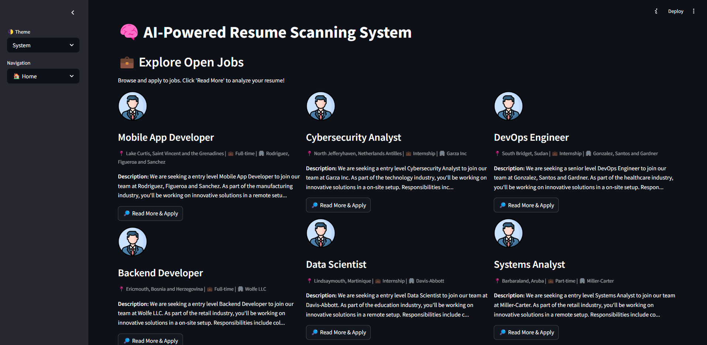
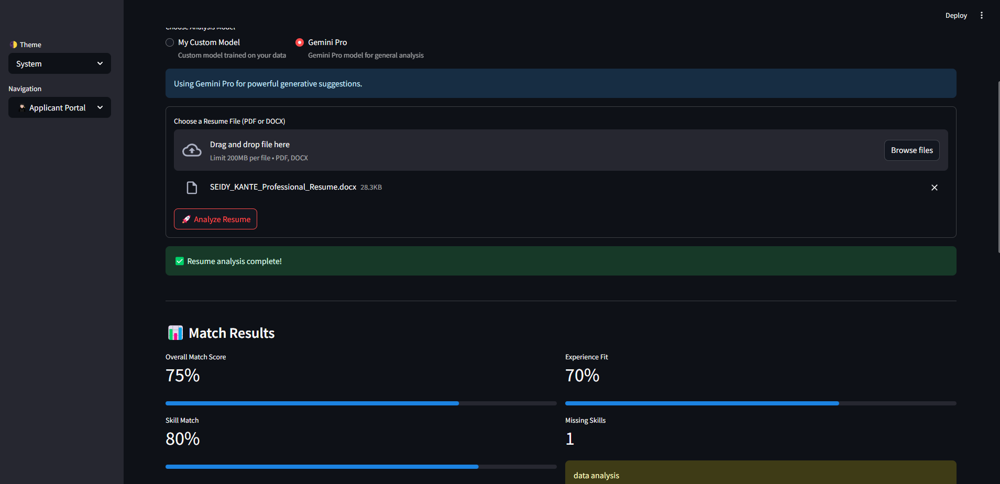
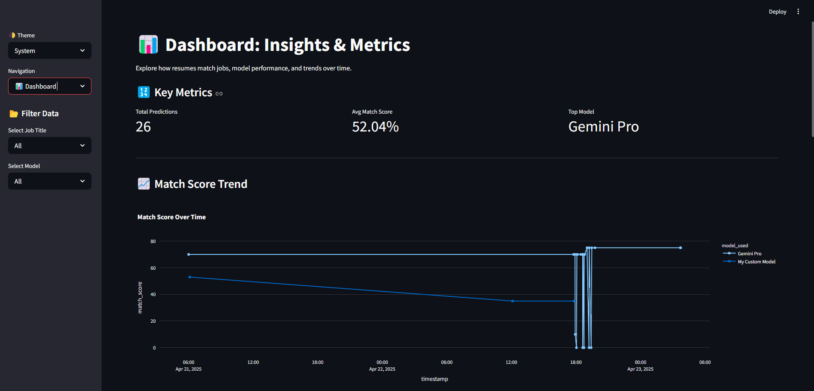
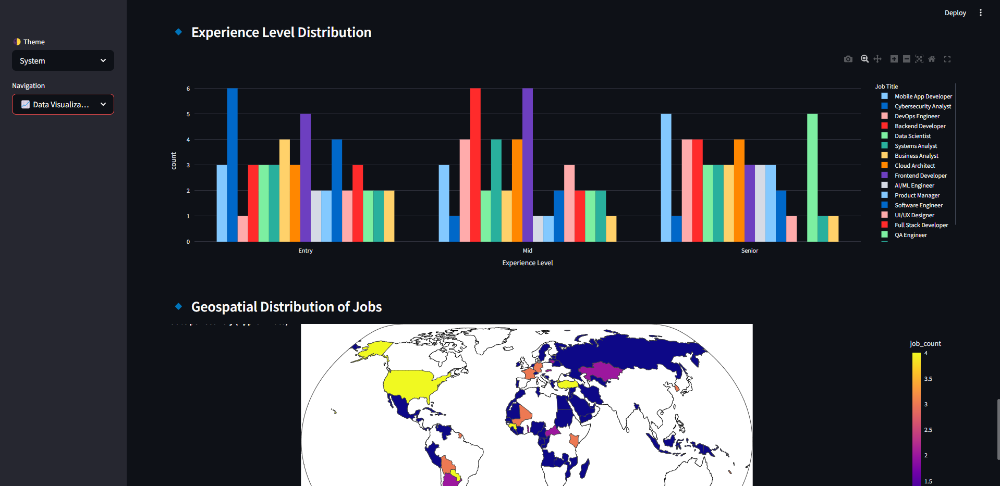

# 🧠 AI-Powered Resume Screening System

An advanced, intelligent, and fully interactive job application screening system that leverages AI models (Custom LSTM and Gemini Pro), NLP techniques, and dynamic visualizations to assist HR teams and job seekers with smart matching and actionable insights.

---

## ✨ Key Features

### 👔 For HR Professionals

- 📋 Add, edit, and manage job listings
- 📊 Comprehensive analytics dashboard with interactive visualizations
- 📈 Real-time insights into job market trends and performance
- 🌍 Country-based and geospatial visualizations
- 📁 Easily export prediction results

### 🙋‍♂️ For Job Applicants

- 🧠 Intelligent resume matching with job descriptions
- 📎 Upload resumes to get personalized job matches
- 🔍 Visual feedback on missing or suggested skills
- 🤖 Choose between:
  - ✅ **Custom LSTM model**
  - 🔮 **Gemini Pro (LLM via API)**
- 📊 See how your resume aligns with job expectations

### 📊 Data Visualization Dashboard

- 🎯 Job title, employment mode, and location distributions
- ☁️ Skills WordCloud for demand overview
- 💰 Salary vs. Experience/Employment scatter plots
- 🌐 Country-based and geospatial plots
- etc...

---

## ⚙️ Tech Stack

- **Frontend**: Streamlit
- **Backend**: Python
- **AI Models**:
  - 🧬 Custom LSTM (Keras/TensorFlow)
  - 🧠 Gemini Pro (Google LLM via API)
- **NLP & Data Processing**: spaCy, pandas, numpy
- **Visualization**: Plotly, Seaborn, Matplotlib, WordCloud
- **Geospatial Mapping**: Plotly Express

---

## 🚀 Getting Started

### 1. Clone the Repository

```bash
git clone https://github.com/SEIDY-KANTE/ai-powered-resume-scanning-system.git
cd ai-powered-resume-scanning-system
```

### 2. Create a Virtual Environment

```bash
python -m venv venv
source venv/bin/activate  # On Windows: venv\Scripts\activate
```

### 3. Install Dependencies

```bash
pip install -r requirements.txt
```

### 4. Configure API Keys

- Add your Gemini Pro API key as `GEMINI_API_KEY` in a `.env` file

### 5. Launch the App

```bash
streamlit run streamlit_app.py
```

---

## 📸 Screenshots

| Home Page | Resume Analysis | HR Panel 
|-----------|------------------|----------
  |  | 

| Analytics Dashboard | Visualization
|----------------------|----------------------|
 | 
---

## 🤖 AI Model Overview

### 🔧 Custom LSTM Model

A deep learning model trained on resume and job description datasets to understand relevance and predict match scores based on skills and experience.

### 🧠 Gemini Pro Integration

A large language model (LLM) by Google integrated via API for powerful and context-aware analysis of resumes and job descriptions.

---

## 📃 License


Distributed under the MIT License. See the [LICENSE](https://github.com/SEIDY-KANTE/ai-powered-resume-scanning-system/blob/main/LICENSE) for more information.

---

## 🫱🏻‍🫲🏾 Contributors


- [🧑‍💻 SEIDY KANTE](https://github.com/SEIDY-KANTE)
- [👩‍💻 ŞEYMA KARTAL](https://github.com/kartalicesym)
- [🧑‍💻 HAMADOUNE BARY](https://github.com/Bary253)

---

> 🚀 Built with passion for the future of AI-driven hiring.

> 💬 Contributions, feedback, and ideas are always welcome!